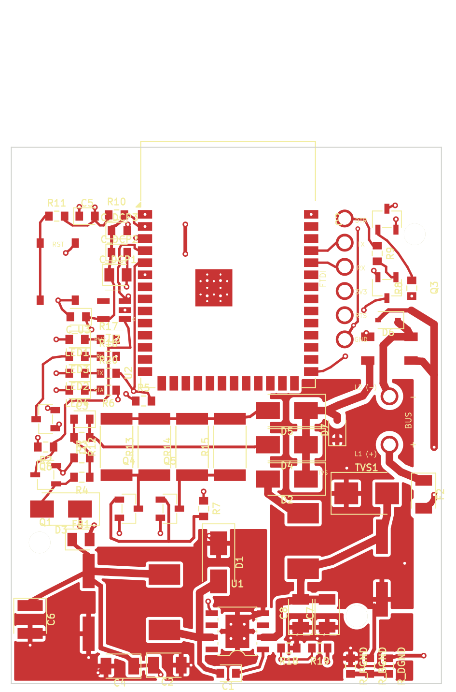
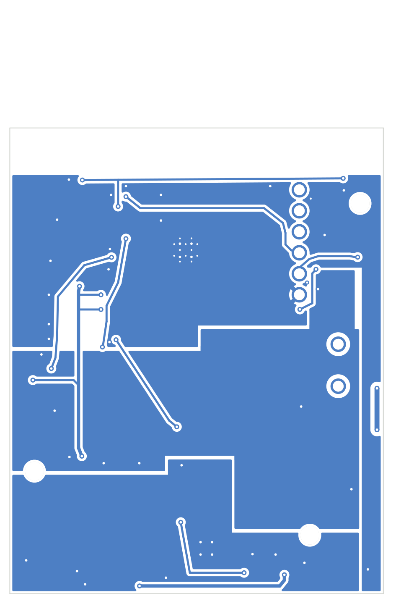

# abb-welcome-gateway

ESP32-S3 gateway that connects an **ABB-Welcome / Busch-Welcome** 2-wire door
intercom to **Home Assistant**: doorbell notifications, remote door opening and
diagnostics, powered directly from the intercom bus.

| Top | Bottom |
|---|---|
|  |  |

## Highlights

- **Bus-powered**: TPS5430 buck converter runs the board from the ~28 V bus.
- **ESP32-S3-WROOM-1** with the antenna at the board edge and a proper copper
  keep-out.
- **Clean bus front-end**: filtered tap, TVS + reverse-polarity protection,
  polyfuse, Schmitt-buffered RX and open-drain TX drivers.
- **Three separated ground islands** (power / digital / bus) stitched at a
  single star point, so switching and RF return currents stay out of the bus
  reference.
- **ESPHome firmware**: native Home Assistant integration, OTA updates,
  YAML-only configuration for the end user.

## Repository layout

| Path | Contents |
|---|---|
| [`hardware/kicad-v3/`](hardware/kicad-v3/) | **The board** (KiCad 9): fully routed 2-layer PCB, DRC-clean. Source of truth for the hardware. |
| [`firmware/esphome/`](firmware/esphome/) | ESPHome configuration + `abb_welcome` custom component. |
| [`docs/`](docs/) | [Status](docs/STATUS.md) · [Pending tasks](docs/TODO.md) · [User guide](docs/user-guide.md). |
| [`legacy/`](legacy/) | Frozen design history: original EasyEDA v2 design, the tscircuit schematic capture of v3 and the conversion tooling. |

## Status

- **Hardware**: v3.0 design finished and fully routed; pre-fabrication
  verification pending (details in [docs/STATUS.md](docs/STATUS.md)).
- **Firmware**: ESPHome skeleton in place; ABB-Welcome bus protocol in
  development ([docs/TODO.md](docs/TODO.md)).

## Getting started

See the [user guide](docs/user-guide.md) for wiring, first flash over the
FTDI header and Home Assistant setup.

For hardware development: open `hardware/kicad-v3/abb-welcome-gateway-v3.kicad_pro`
in KiCad 9. Design rules, net classes and the ground-island scheme are described
in [`hardware/kicad-v3/README.md`](hardware/kicad-v3/README.md).

## Donations for software development

If this project is useful to you, you can support its development:

Thank you for collaborating and helping the development of software improvements.

## Credits & license

The hardware derives from the original bus interface design by **mat931**.
Hardware is licensed under **CERN-OHL-W v2** (see [`LICENSE`](LICENSE));
the full design history is preserved in [`legacy/`](legacy/) and in the git log.
