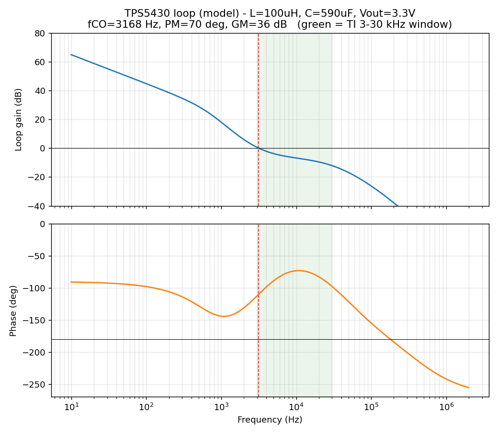

# Pre-fabrication analysis

Numerical checks for the two open items in
[`docs/STATUS.md`](../../../docs/STATUS.md) → *To verify before fabrication*:

1. **Buck control loop** with `L2 = 100 µH` and ~590 µF of bulk — is it stable
   and fast enough?
2. **TVS1 (SMBJ30A) clamp** versus the TPS5430's 36 V VIN absolute maximum.

These are **models to guide the bench measurement, not a replacement for it.**
Absolute phase-margin numbers carry roughly ±15° of modelling/tolerance
uncertainty; the *trends* are what matter.

## Run

```sh
python3 buck_loop_analysis.py   # prints margins table + writes tps5430_bode.png
python3 tvs_clamp.py            # prints TVS clamp vs surge current
```

Requires `numpy`, `scipy`, `matplotlib`.

---

## 1. Buck loop stability

**Model.** The TPS5430 is a voltage-mode buck with a *fixed internal type-III*
compensation network whose transfer function is published in the datasheet
(SLVS632, Eq. 15): zeros at 2170 / 2590 Hz, poles at 2165 Hz (integrator),
24 k, 54 k, 440 kHz. We combine it with the power stage built from the **real
output-cap network** (C19 470 µF Al, C6 100 µF Ta, C2/C4 10 µF Ta — each as
`ESR + 1/sC` in parallel) and calibrate the one unknown constant (the
feed-forward modulator gain `VIN/Vramp`) so the datasheet's own worked example
(5 V, 15 µH, 220 µF, 40 mΩ) crosses 0 dB at 18 kHz. Calibrated value ≈ **22.9**,
which is physically sensible for this part.

**Result (nominal, C19 ESR = 0.10 Ω, 0.3 A load):**

| Metric | Value |
|---|---|
| Crossover `fCO` | **≈ 3.2 kHz** |
| Phase margin | **≈ 70°** |
| Gain margin | **≈ 36 dB** |
| Load-step 0.3 A | ~27 mV dip, ~0.6 ms recovery |



**Why this refines the STATUS.md note.** The note estimated `fCO ≈ 1.5 kHz`
(from TI's Eq. 7, `fLC²/85·VOUT`) and worried it sat *below* TI's 3–30 kHz
window — sluggish and marginal. Eq. 7 is **pessimistic here because it assumes a
low-ESR output cap**. In reality the aluminium electrolytic's ESR zero
(≈ 3.4 kHz) sits inside the loop, lifts the gain and, together with the internal
type-III zeros at 2.2 / 2.6 kHz, pushes the crossover **up to ~3.2 kHz — the
bottom edge of TI's window — with a healthy ~70° phase margin.** The note's
instinct ("stable thanks to the ESR") is correct; the "marginal" part is not.

**Robustness.** Stable across the whole plausible electrolytic ESR range and load:

| C19 ESR (Ω) | 0.05 | 0.08 | 0.10 | 0.12 | 0.15 | 0.20 |
|---|---|---|---|---|---|---|
| Phase margin | 48° | 62° | 70° | 79° | 90° | 106° |

Phase margin *increases* with ESR, and the worst case (fresh/warm cap, ESR ≈
0.05 Ω) still gives ~48°. Load current 0.1–2 A holds ~70°. So the design is
comfortably stable in the model.

**Confirmed warning — do NOT swap the bulk for low-ESR ceramics.** Removing the
ESR zero collapses the phase margin from ~70° to **~19°** (ringy / marginal):

| Output bulk | fCO | Phase margin |
|---|---|---|
| 590 µF electrolytic/Ta (as designed) | 3.2 kHz | **70°** |
| 590 µF low-ESR ceramic | 2.6 kHz | **19°** ⚠ |

Keep C19/C6/C2/C4 as specified, or add an external compensation network first.

**Bench check on the first board:** loop is *predicted* fine, but the crossover
is set by the electrolytic ESR (drifts with temperature/age). Confirm with a
load-step (look for clean recovery ~0.5 ms, no sustained ringing) or, better, an
injected-signal Bode. Expect crossover ~3 kHz and no gain peaking.

---

## 2. TVS1 clamp vs buck VIN abs-max

**Model.** Piecewise-linear TVS, `Vclamp(I) = VBR + I·Rdyn`. SMBJ30A datasheet
points: `VWM = 30 V`, `VBR(min) = 33.3 V`, `VC = 48.4 V @ IPP = 12.4 A`
→ `Rdyn ≈ 1.22 Ω`.

| TVS current | Clamp voltage | vs 36 V abs-max |
|---|---|---|
| 0.5 A | 33.9 V | OK |
| 1 A | 34.5 V | OK |
| **2.2 A** | **36.0 V** | = abs-max |
| 5 A | 39.4 V | over |
| 12.4 A | 48.4 V | over |

**Reading.** At the 28 V bus nominal the 30 V standoff means no conduction, and
clamping only starts above ~33 V — good. The buck's 36 V abs-max is exceeded
only once the TVS conducts **more than ~2.2 A**. Two mitigations decide whether
that matters:

- **Fast transients (ESD / inductive spikes): covered.** `L3 = 100 µH` in
  series plus the input caps isolate the buck VIN node — the buck never sees the
  fast edge, so the clamp voltage at the bus side is not what reaches it.
- **Slow, sustained high-current overvoltage: residual gap.** L3 has no
  impedance at DC, so a slow fault that drives >2.2 A into the TVS can pull the
  buck VIN above 36 V while the TVS clamps at up to 48 V.

For a 28 V low-voltage intercom bus a high-energy surge is unlikely, so the
practical risk is low. For guaranteed protection (belt-and-suspenders):

- **Relocate TVS1 to the buck VIN node (downstream of L3)** — near-free board
  revision, clamps the node the buck actually sees; or
- use a **40–60 V-rated buck** (e.g. TPS54360, LMR14030) for unconditional VIN
  headroom.
